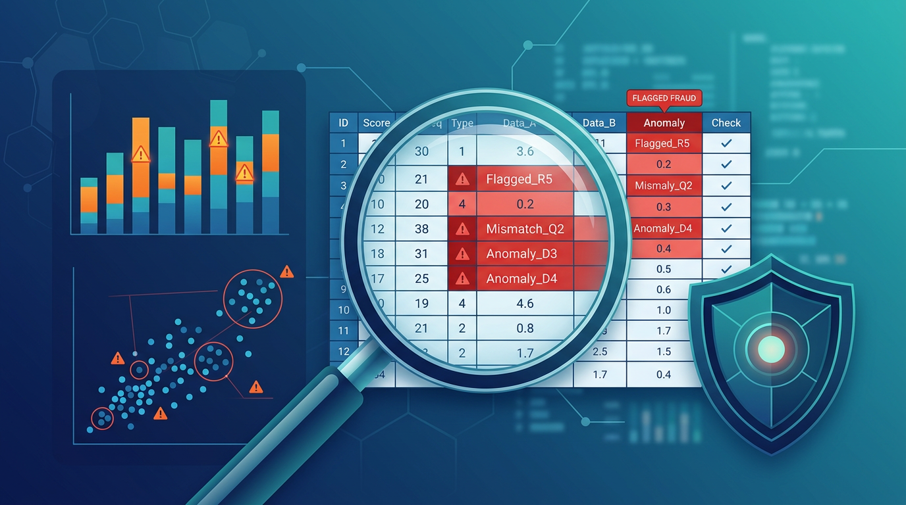
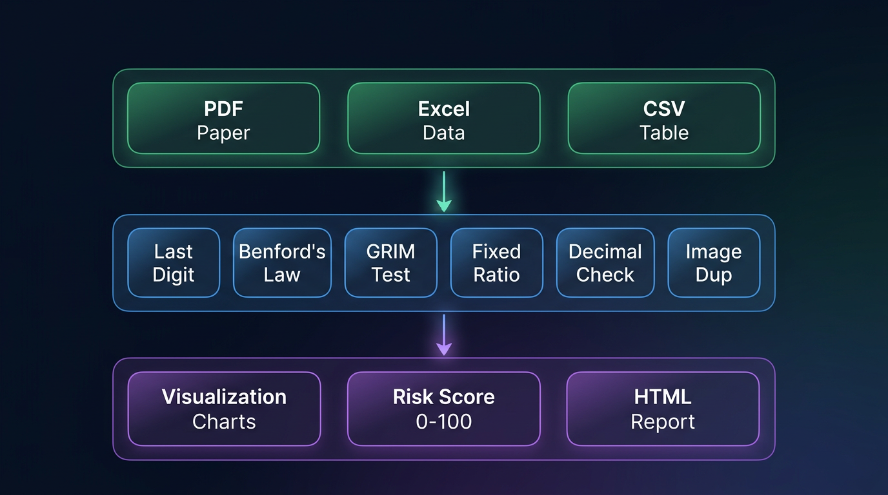
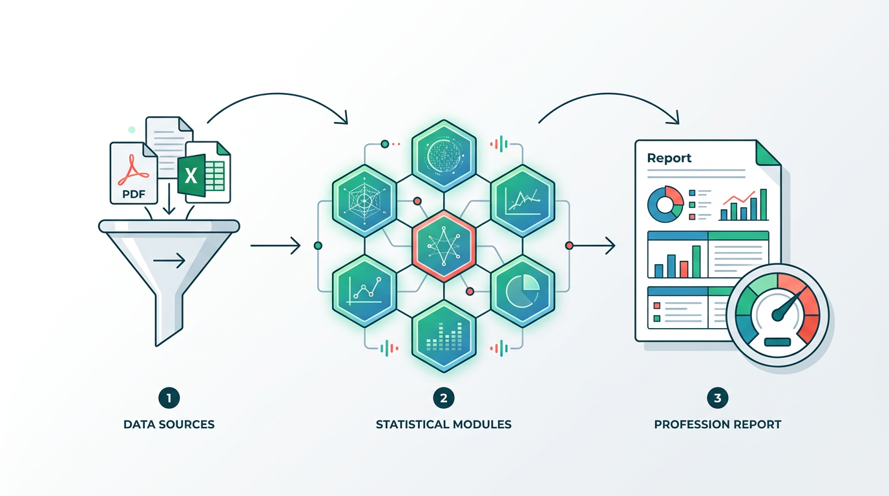

<p align="center">
  
</p>

<h1 align="center">🔬 Geng Skill — 学术数据打假检测工具</h1>

<p align="center">
  <strong>用数据说话，让造假无所遁形 · Inspired by "耿同学讲故事"</strong>
</p>

<p align="center">
  
  
  
  
</p>

<p align="center">
  <a href="#-快速开始">Quick Start</a> •
  <a href="#-工作原理">How It Works</a> •
  <a href="#-三种输入模式">Input Modes</a> •
  <a href="#-检测模块">Detection Modules</a> •
  <a href="#-实战案例">Example</a> •
  <a href="#-文档">Documentation</a>
</p>

---

## 🌟 这是什么？

**Geng Skill** 是一套基于统计学原理的学术论文数据造假检测工具包。

2026 年 4 月起，科普博主"耿同学讲故事"凭一台电脑和几个统计方法，连续揪出多所 985 高校顶尖学者的论文造假——同济大学 Nature 论文院长免职、南开大学 Nature 子刊正在调查……他证明了一件事：**造假的数据一定会留下统计学破绽。**

本项目将"耿同学"的技术方法论系统化、工具化，让任何人都能一键检测论文数据是否存在造假嫌疑。

> 💡 **核心原理**：真实实验数据具有随机性；人为编造的数据会呈现不自然的数学规律。

---

## 🚀 快速开始

```bash
# 克隆仓库
git clone https://github.com/YOUR_USERNAME/geng-skill.git
cd geng-skill
pip install -r requirements.txt

# 一键自动扫描（Scale 模式）
python3 scripts/input_pipeline.py --input your_data.csv --mode scale
```

就这么简单。Scale 模式会**自动扫描所有数值列**，运行 6 种检测算法，并按嫌疑程度从高到低排列结果。

---

## 🧠 工作原理

<p align="center">
  
</p>

系统分为三层：

### 第一层 · 数据输入 Input Pipeline

支持 **PDF 论文**、**Excel 原始数据**、**CSV 表格** 三种格式。自动提取表格、识别数值列、标准化数据格式。

### 第二层 · 检测引擎 Detection Engine

6 个独立的统计检测模块，从不同角度分析数据异常：

| 模块 | 检测目标 | 方法 |
|------|----------|------|
| **末位数字检测** Last Digit | 末位数字集中度异常 | Chi-squared vs 均匀分布 |
| **本福特定律** Benford's Law | 首位数字分布偏离 | Chi-squared + MAD |
| **GRIM 测试** | 均值与样本量不兼容 | 离散粒度校验 |
| **固定关系检测** Fixed Ratio ⭐ | 实验组间存在完美数学关系 | 比值/回归分析 |
| **小数位一致性** Decimal | 小数部分模式重复 | 自相关 + 熵分析 |
| **图像重复检测** Image Dup | 同一图片在不同条件下重复使用 | 感知哈希 + SSIM |

### 第三层 · 输出报告 Output

生成出版级可视化图表、综合风险评分（0–100）、以及详细的 HTML/Markdown 检测报告，精确标注每个可疑数据点。

---

## 📥 三种输入模式

<p align="center">
  
</p>

### 模式一：论文 PDF 输入

直接从 PDF 论文中提取数据表格：

```bash
python3 scripts/input_pipeline.py --input paper.pdf --mode extract
```

### 模式二：Excel / CSV 原始数据

处理从论文下载的 Supplementary Data：

```bash
python3 scripts/input_pipeline.py --input supplementary_data.xlsx --mode extract
python3 scripts/input_pipeline.py --input table_s1.csv --mode extract
```

### 模式三：Scale 自动扫描 ⭐（推荐）

**让工具自己去找问题。** 无需指定检测哪些列、用哪些方法——全部自动：

```bash
python3 scripts/input_pipeline.py --input data.csv --mode scale
```

Scale 模式会：
1. 自动识别所有数值列
2. 运行 6 大检测模块
3. 交叉验证各模块结果
4. 输出 **suspicion_ranking**（嫌疑排名榜）

---

## 🔬 检测模块

### ⭐ 固定关系检测（核心 · 耿同学的看家本领）

这是最致命的检测手段。如果两组"独立实验"数据之间存在**完美的固定数学关系**（比如每个样本 Treatment = Control × 2.0），那几乎可以断定是造假。

```python
from fixed_relation_test import fixed_relation_test

result = fixed_relation_test(control_data, treatment_data)
# result['risk_score'] = 95  → 检测到精确 2.0 倍关系！
```

**为什么这能定性？** 即使药物真的让蛋白表达提高 2 倍，每个样本也会有生物学个体差异。20 个样本**全部**精确到小数点后多位都是 2.000 倍——概率趋近于零。

### 本福特定律检测 Benford's Law

跨越多个数量级的自然数据，首位数字遵循特定概率分布（1 最多，9 最少）。人为编造的数据会偏离：

```python
from benford_test import benford_test
result = benford_test(values)
```

### GRIM 测试

对于整数取值的数据（如李克特量表 1–5 分），给定样本量 n，并非所有均值都是数学上可能的：

```python
from grim_test import grim_test_single
result = grim_test_single(mean='3.47', n=25, decimals=2)
# result['consistent'] = False  → 这个均值是不可能存在的！
```

---

## 🧪 实战案例

### 输入：一篇可疑的生物医学论文数据

论文声称对小鼠进行了三组独立实验（Control / Treatment A / Treatment B），数据如下：

```csv
sample_id,control,treatment_a,treatment_b
1,2.34,4.68,7.02
2,3.12,6.24,9.36
3,1.87,3.74,5.61
4,4.56,9.12,13.68
5,2.98,5.96,8.94
...
```

### 运行 Scale 模式自动检测

```bash
python3 scripts/input_pipeline.py --input data.csv --mode scale
```

### 输出：精准定位问题

```
=== Scale Mode: 自动检测结果 ===

  🔴 [1.00] control ↔ treatment_a    ← 精确固定比值 = 2.000
  🔴 [1.00] control ↔ treatment_b    ← 精确固定比值 = 3.000
  🔴 [1.00] treatment_a ↔ treatment_b ← 精确固定比值 = 1.500
  🟠 [0.99] treatment_a               ← 末位数字分布异常

  ╔══════════════════════════════════════════════════════════════╗
  ║  综合风险评分:  92/100  🔴 极高风险                          ║
  ╠══════════════════════════════════════════════════════════════╣
  ║  三组"独立实验"数据之间存在完美的整数倍关系。                ║
  ║  在真实生物实验中，这种情况出现的概率约等于零。              ║
  ║  数据极大概率为人工编造。                                    ║
  ╚══════════════════════════════════════════════════════════════╝
```

---

## 📊 风险评分体系

| 分数 | 等级 | 含义 | 建议行动 |
|------|------|------|----------|
| 0–25 | 🟢 低风险 | 未发现异常 | 无需干预 |
| 26–50 | 🟡 中等 | 存在轻微模式，可能是正常波动 | 建议复核 |
| 51–75 | 🟠 高风险 | 多项指标异常 | 深入调查 |
| 76–100 | 🔴 极高风险 | 系统性异常 | 正式举报 |

**置信度规则：**
- 单一模块报警 → 标注为"待确认线索"
- 2 个以上独立模块同时报警 → 标注为"高度可疑"
- 仅当综合分 > 75 **且**多模块交叉确认时，才标注"极高风险"

---

## ⚖️ 准确性与免责声明

### ✅ 本工具能做什么

- 检测不同数据列之间的固定数学关系
- 识别数字分布的统计学异常
- 标记数学上不可能的统计报告值
- 发现重复使用/篡改的论文图片
- 提供量化的风险评估和置信度等级

### ❌ 本工具不能做什么

- 不能证明造假的主观意图
- 不能检测加了随机噪声的"高明造假"
- 不能替代领域专家的判断
- 不具备法律效力

### ⚠️ 重要声明

> **本工具仅提供统计学层面的异常筛查功能。**
> 输出结果为"疑点线索"（Suspicious Indicators），而非"造假判定"（Fraud Determination）。
>
> - 统计异常可能有合理的科学解释（仪器精度限制、数据标准化处理、单位转换等）
> - 最终判定需要领域专家复核和正式调查程序
> - 通过全部检测 ≠ 数据一定真实（某些造假无法被统计方法捕获）
> - 使用者需自行承担因不当使用（如公开发布未经验证的指控）造成的一切后果

---

## 📁 项目结构

```
geng-skill/
├── scripts/                        核心引擎
│   ├── input_pipeline.py           统一输入（PDF/Excel/CSV + Scale 模式）
│   ├── visualization.py            出版级可视化图表
│   ├── report_generator.py         HTML + Markdown 报告生成
│   ├── geng_assess.py              综合评估引擎
│   ├── last_digit_test.py          末位数字检测
│   ├── benford_test.py             本福特定律检测
│   ├── grim_test.py                GRIM 均值一致性测试
│   ├── fixed_relation_test.py      固定关系检测 ⭐
│   ├── decimal_consistency_test.py 小数位一致性检测
│   └── image_duplicate_test.py     图像重复检测
├── docs/                           完整文档
│   ├── USAGE_GUIDE.md              多平台使用指南（Claude/Cursor/GPT/Codex 等）
│   ├── DATA_SOURCES.md             学术参考文献 + 数据标准 + 伦理合规
│   ├── ANNOTATIONS.md              架构图 + API 接口 + 代码注释规范
│   └── EXAMPLE_WALKTHROUGH.md      端到端完整教程
├── examples/                       示例数据
├── tests/                          单元测试（24/24 通过）
└── assets/                         README 配图
```

---

## 📖 文档

| 文档 | 内容 |
|------|------|
| [USAGE_GUIDE.md](docs/USAGE_GUIDE.md) | 在 Claude / Cursor / GPT / Codex / Jupyter / Docker 等平台上的使用方法 |
| [DATA_SOURCES.md](docs/DATA_SOURCES.md) | 学术参考文献、数据标准、伦理合规框架 |
| [ANNOTATIONS.md](docs/ANNOTATIONS.md) | 系统架构、API 接口规范、代码注释标准 |
| [EXAMPLE_WALKTHROUGH.md](docs/EXAMPLE_WALKTHROUGH.md) | 从一篇论文到检测报告的完整教程 |
| [SKILL.md](SKILL.md) | Skill 核心技术文档 |

---

## 🔗 学术参考

1. Benford, F. (1938). The law of anomalous numbers. *Proc. APS*, 78(4), 551–572.
2. Brown, N.J.L. & Heathers, J.A.J. (2017). The GRIM Test. *SPPS*, 8(4), 363–369.
3. Bik, E.M. et al. (2016). Image duplication in biomedical research. *mBio*, 7(3).
4. Nigrini, M.J. (2012). *Benford's Law*. Wiley. ISBN: 978-1118152850.
5. 余菁等 (2021). 科技论文数据造假的核查策略. *中国科技期刊研究*, 32(6), 770–776.

---

## 🙏 致谢

本项目的灵感来源于 **"耿同学讲故事"** —— 一位吉林大学生物学硕士、北航退学博士，从 2026 年 4 月开始，仅凭一台电脑和统计学方法，就揪出了多所顶尖高校教授的论文数据造假。他的工作证明了：**学术诚信监督不仅必要，而且完全可行。**

> "如果论文里的数据存在规律性，那么就明显不是在实验室实际测量的情况下生成的。"
> 
> —— 耿同学

---

## 📄 开源许可

MIT License — 详见 [LICENSE](LICENSE)

---

<p align="center">
  <em>让学术回归诚信，让数据说出真相。</em><br>
  <em>Let academic integrity prevail. Let data speak the truth.</em>
</p>
